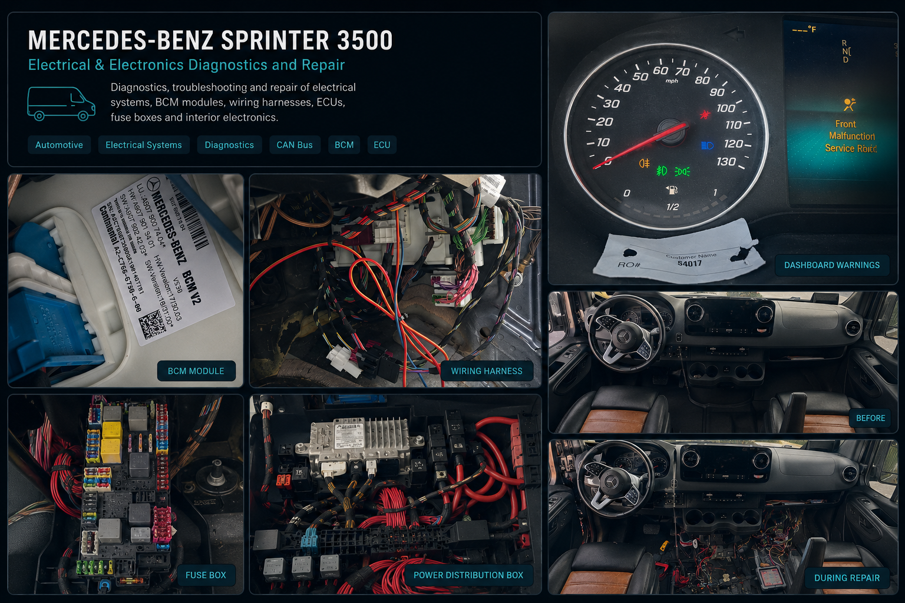
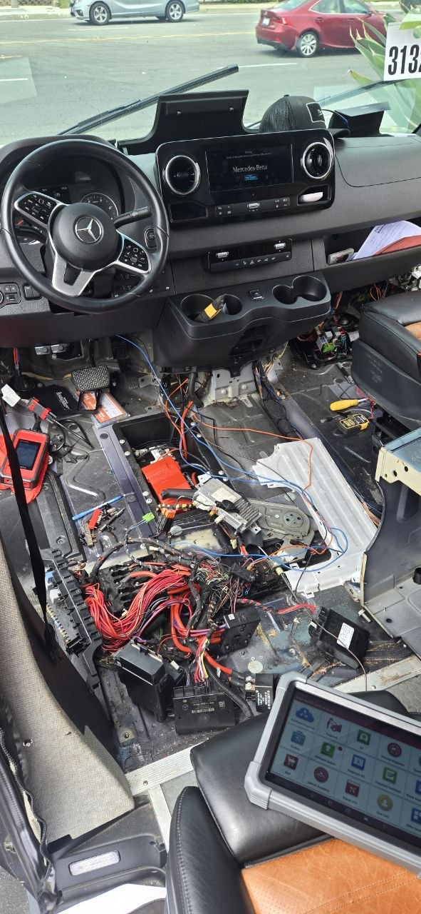
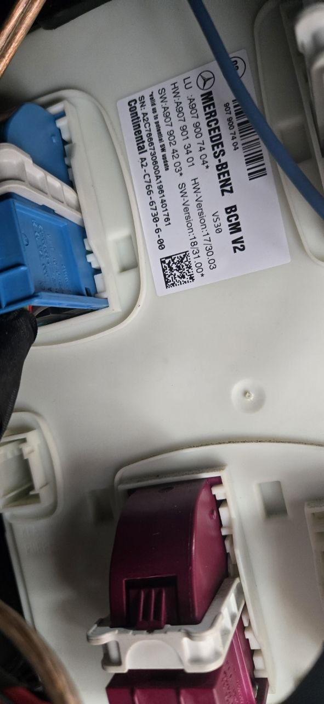
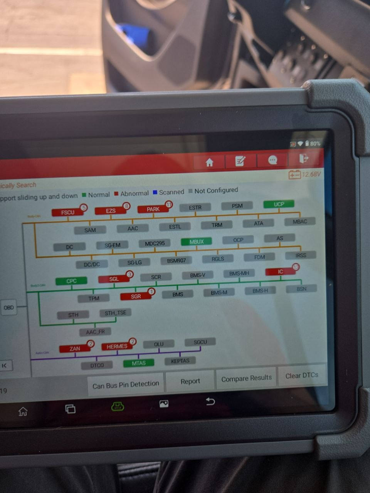

# Mercedes Sprinter 907 CAN Bus Short Circuit Repair

Diagnosis and repair of a CAN High/CAN Low short circuit on a converted 2019 Mercedes Sprinter 3500 camper van.

Діагностика та ремонт короткого замикання CAN High/CAN Low на переобладнаному кемпері Mercedes Sprinter 3500 2019 року.

  

---

🇺🇸 [English](#english)

🇺🇦 [Українська](#українська)

---

# English

## Project Overview

This project documents the diagnosis and repair of a CAN bus communication failure on a converted 2019 Mercedes Sprinter 3500 camper van.

The vehicle was professionally converted into a camper by RB Components. A damaged section of the CAN wiring harness eventually caused a short circuit between CAN High and CAN Low, resulting in multiple communication failures and a complete no-start condition.

The issue was successfully diagnosed and repaired without replacing any electronic control modules.

---

## Vehicle Information

| Parameter          | Value               |
| ------------------ | ------------------- |
| Make               | Mercedes-Benz       |
| Model              | Sprinter 3500 (907) |
| Year               | 2019                |
| Engine             | OM642 3.0L V6 DOHC  |
| Conversion Company | RB Components       |

---

## Symptoms

The vehicle exhibited several unusual electrical problems:

* Engine would not start
* Instrument cluster powered on immediately after connecting the battery
* Front and rear fog light indicators remained illuminated
* Low beam indicator stayed active even when lights were off
* Low beams turned on after pressing START and could not be switched off
* Dashboard buttons were completely inoperative
* Turn signals did not function
* Hazard lights operated only the rear indicators
* Windshield wipers were inoperative
* Horn did not function

---

## Initial Diagnostics

The first step was to verify battery condition.

The battery was discharged and was fully recharged, but the symptoms remained unchanged.

A Launch X431 Elite Pro diagnostic scanner was connected to perform a complete vehicle scan and CAN topology analysis.

Several control modules were missing from the network topology, and multiple fault codes pointed toward communication issues involving the Front Signal Acquisition Module (FSAM).

---

## Wiring Investigation

At the beginning of the repair process, factory wiring diagrams were not available.

The investigation started by tracing the windshield wiper circuits to identify the responsible control units.

This led to:

* Passenger seat fuse box
* Mercedes-Benz BCM V2 controller

To continue the diagnosis, complete wiring diagrams and service documentation were purchased through ALLDATA DIY.

---

## CAN Network Analysis

Using the factory wiring diagrams, the CAN network was analyzed.

Expected resistance:

60 Ω

Measured resistance:

0 Ω

This immediately indicated a direct short circuit between CAN High and CAN Low.

The BCM V2 connector was disconnected, and individual CAN branches were isolated one at a time.

After disconnecting one particular branch:

* Additional control modules appeared
* Vehicle systems started responding
* Communication was restored
* The vehicle partially came back to life

This confirmed that the fault was located within that specific CAN segment.

---

## Root Cause

Using a wire tracer, the entire wiring route was inspected.

The original conversion work had allowed the wiring to rub against surrounding components over time, causing damage to the insulation and creating a direct short circuit between CAN High and CAN Low conductors.

---

## Repair Process

The damaged section of wiring was repaired and properly insulated.

After reconnecting the CAN network:

* CAN resistance returned to normal
* All modules became visible again
* Communication errors disappeared
* Engine started successfully
* Vehicle systems operated normally

No control modules required replacement.

---

## Tools Used

* [Launch X431 Elite Pro] (https://www.launchx431online.com/products/launch-x431-pro3-v-elite-diagnostic-scanner-j2534-programming)
* Digital Multimeter - [FNIRSI® DMC-100](https://www.fnirsi.com/products/dmc-100)
* Wire Tracer / Cable Tracker - [Klein Tools VDV500] (https://www.kleintools.com/catalog/tone-probe/tone-probe-test-and-trace-kit)
* ALLDATA DIY Service Information
* Mercedes-Benz Wiring Diagrams

---

## Project Files

### Documentation

* docs/After_Sprinter.pdf
* docs/Before_Sprinter.pdf

### Images

  
  
  

---

## Lessons Learned

* Always verify CAN resistance before replacing expensive modules.
* Factory wiring diagrams significantly reduce troubleshooting time.
* Vehicle conversions may introduce hidden electrical risks.
* CAN topology analysis is extremely valuable for locating communication failures.
* Systematic isolation of network branches is often the fastest diagnostic method.

---

# Українська

## Огляд проекту

У цьому проекті описано процес діагностики та ремонту несправності CAN-шини на переобладнаному кемпері Mercedes Sprinter 3500 2019 року.

Автомобіль був переобладнаний компанією RB Components. Пошкодження проводки призвело до короткого замикання між CAN High та CAN Low, що викликало численні помилки зв'язку між модулями та неможливість запуску двигуна.

Несправність була успішно усунена без заміни жодного електронного блоку керування.

---

## Інформація про автомобіль

| Параметр                | Значення            |
| ----------------------- | ------------------- |
| Марка                   | Mercedes-Benz       |
| Модель                  | Sprinter 3500 (907) |
| Рік                     | 2019                |
| Двигун                  | OM642 3.0L V6 DOHC  |
| Компанія-переобладнувач | RB Components       |

---

## Симптоми

Спостерігалися наступні несправності:

* Двигун не запускався
* Панель приладів вмикалася одразу після підключення акумулятора
* Горіли індикатори передніх і задніх протитуманних фар
* Індикатор ближнього світла був активний навіть при вимкнених фарах
* Після натискання START ближнє світло вмикалося та не вимикалося
* Не працювали кнопки на центральній панелі
* Не працювали покажчики повороту
* Аварійна сигналізація працювала лише на задні ліхтарі
* Не працювали двірники
* Не працював звуковий сигнал

---

## Початкова діагностика

Спочатку була перевірена напруга акумулятора.

Після повного заряджання ситуація не змінилася.

Для діагностики використовувався сканер Launch X431 Elite Pro з відображенням топології CAN-мережі.

Було виявлено відсутність декількох модулів, а більшість помилок вказувала на проблеми зв'язку з модулем FSAM.

---

## Дослідження електропроводки

На початку ремонту заводських схем не було.

Пошук почався з системи двірників для визначення відповідних модулів керування.

Було знайдено:

* Блок запобіжників під пасажирським сидінням
* Контролер Mercedes-Benz BCM V2

Після цього були придбані офіційні схеми та документація через сервіс ALLDATA DIY.

---

## Аналіз CAN-мережі

Після отримання схем була перевірена CAN-шина.

Нормальний опір:

60 Ом

Фактичний опір:

0 Ом

Це свідчило про коротке замикання між CAN High та CAN Low.

Після відключення окремих гілок мережі від BCM V2 було знайдено проблемний сегмент.

Після його відключення:

* З'явилися додаткові модулі
* Автомобіль почав реагувати
* Відновився зв'язок між блоками

---

## Причина несправності

За допомогою трасошукача була перевірена вся проводка.

Через тертя проводки об конструктивні елементи з часом була пошкоджена ізоляція, що призвело до короткого замикання між CAN High та CAN Low.

---

## Ремонт

Пошкоджену ділянку проводки було відремонтовано та заізольовано.

Після ремонту:

* Опір CAN повернувся до норми
* Усі модулі стали доступними
* Помилки зв'язку зникли
* Двигун успішно запустився
* Усі системи працювали штатно

Жоден електронний блок не потребував заміни.

---

## Використані інструменти

* Launch X431 Pro3 V+ Elite
* Цифровий мультиметр - FNIRSI® DMC-100
* Трасошукач проводки - Klein Tools VDV500
* ALLDATA DIY 
* Заводські електросхеми Mercedes-Benz

---

## Висновки

* Перед заміною модулів необхідно перевіряти опір CAN-шини.
* Заводські електросхеми значно прискорюють діагностику.
* Переобладнання автомобілів може створювати приховані електричні проблеми.
* Аналіз топології CAN значно спрощує пошук несправностей.
* Послідовне відключення гілок мережі є одним із найефективніших методів діагностики.
